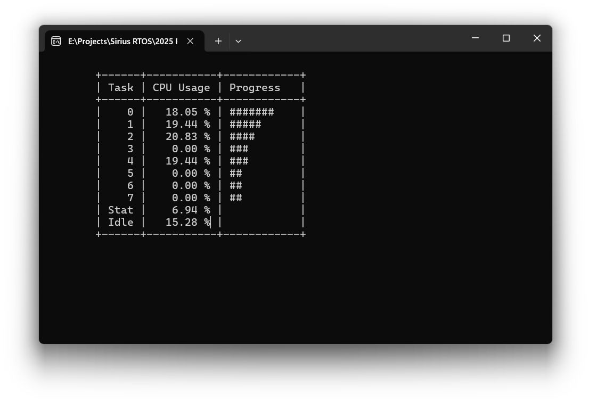

# SpaceShadow Sirius RTOS

**Sirius RTOS** is a robust, preemptive real-time operating system kernel designed to deliver high-end synchronization and resource management features through an intuitive API.

**Note:** *This repository is a code archive from **2010**. It is released now as an open-source reference implementation for software architects, embedded engineers, and OS enthusiasts interested in kernel design, deadlock detection algorithms, and zero-dependency C programming.*


## Overview

Developed during a period when many microcontroller kernels lacked sophisticated synchronization primitives, Sirius RTOS was architected to bridge the gap between lightweight schedulers and full-featured commercial operating systems.

It was originally validated on the **AT91SAM7S64** (ARM7TDMI, WinARM) and includes a custom **Win32 Simulator** layer that allows the kernel logic to run and be debugged as a standard Windows console application.


### Why release this now?

I am releasing this codebase to the community not as a competitor to modern kernels (like Zephyr or FreeRTOS), but as an **architectural foundation** and educational resource. It demonstrates how complex concurrency problems such as Priority Inversion and Deadlocks can be solved on constrained hardware using strict ANSI C.


## Design Philosophy & Architecture

The architecture follows a strict "Power through Safety" philosophy. It was designed for high scalability (5KB to 25KB footprint) while maintaining strict determinism.

```text
+-------------------------------------------------------+
|                  User Application                     |
+--------------------------+----------------------------+
|        OS API            |                            |
+--------------------------+     Standard Lib (STD)     |
|      Sirius Kernel       |                            |
| (Scheduler, IPC, Sync)   |                            |
+--------------------------+----------------------------+
|           Architecture Port (ARCH) / HAL              |
+-------------------------------------------------------+
|          Hardware (ARM7 / Win32 Sim / ...)            |
+-------------------------------------------------------+
```


### Key Architectural Highlights

  * **Zero-Dependency (No LibC):** The codebase is written in strict **ANSI C (C89)**. Crucially, it does **not** rely on the standard C library. It includes its own custom implementation of standard functions (in `STD/`), ensuring the kernel compiles on any platform without "black box" library dependencies.
  * **Deterministic Scheduling:** Features a priority-based preemptive scheduler with Round-Robin for equal-priority tasks and dynamic time-slicing (variable CPU time quanta).
  * **Dual-Strategy Memory Management:** Utilizes a generic heap allocator (O(\log n)) for startup/large chunks, and a deterministic fixed-block allocator (O(1)) for runtime kernel objects to eliminate jitter.
  * **Advanced Synchronization:** Unlike many lightweight kernels of its era, Sirius implements:
      * **Priority Inheritance:** Automatically elevates thread priority to prevent Priority Inversion.
      * **Deadlock Detection:** The kernel tracks ownership cycles and reports potential deadlocks.
      * **Automatic Resource Release:** Ensures system stability if a task terminates while holding a lock.


### System Objects & Primitives

The kernel provides a comprehensive set of objects to manage synchronization and data exchange:

  * **Tasks** (Preemptive, Priority-based)
  * **Mutexes** (Recursive with Priority Inheritance)
  * **Owning Semaphores** (Enforces strict ownership traceability)
  * **Counting & Binary Semaphores**
  * **Events & Event Flags**
  * **Timers**
  * **Shared Memories**
  * **Queues & Pointer Queues** (Priority-ordered wait lists)
  * **Streams & Mailboxes**


## Project Structure

  * **[OS/](OS/) (The Kernel Space):**
      * [OS_API.h](OS/OS_API.h)`: **Start Here.** The single-include entry point for the application layer.
      * [OS_Core.c](OS/OS_Core.c): Contains the heart of the scheduler logic.
      * [OS/](OS/)[Primitives]`: Implementations of Mutexes, Semaphores, etc.
  * **[STD/](STD/) (Standard Library Replacement):** Custom implementation of memory management (`memcpy`, `malloc`), string manipulation, and helper functions required to maintain LibC independence.
  * **[ARCH/](ARCH/) (Hardware Abstraction Layer):** Isolates CPU-specific assembly. Includes ports for **ARM7** and the **Win32 Simulator**.
  * **[TESTS/](TESTS/)`:** Integration scenarios used for validation.
  * **[docs/](https://mmoczala.github.io/SiriusRTOS/index.html)`:** Complete documentation suite generated in classic MSDN-style HTML.


## Quick Start

### Minimal Code Boilerplate

```c
#include <stdio.h>
#include "OS_API.h"

/* Simple Worker Task */
ERROR Main(PVOID Arg)
{
  printf("Hello from Sirius Kernel!\n");

  while(TRUE)
  {
     /* One second sleep */
     osSleep(1000);
     printf("Tick...\n");
  }

  return ERR_NO_ERROR;
}

/* Entry Point */
int main(void)
{
  arInit();   /* Initialize Hardware Abstraction Layer */
  stInit();   /* Initialize Standard Library */
  osInit();   /* Initialize Kernel */

  /* Create main task */
  osCreateTask(Main, NULL, 0, 0, FALSE);

  /* Hand over control to the scheduler */
  osStart();

  /* Cleanup (Reached only if osStop() is called) */
  osDeinit();
  arDeinit();
  return 0;
}
```


### Visual Studio project

The easiest way to explore the kernel logic is via the Visual Studio project. I have updated the repository with a **Microsoft Visual Studio 2022 Community** solution (`SiriusRTOS.sln`). This allows you to build, run, and step through the kernel logic using the Win32 simulator port directly from a modern IDE.




### Documentation

Comprehensive documentation is available via the project's GitHub Pages:

  * [**Kernel Features**](https://mmoczala.github.io/SiriusRTOS/products.html) A detailed list of all implemented synchronization primitives, IPC mechanisms, and scheduling capabilities.
  * [**OS API Reference**](https://mmoczala.github.io/SiriusRTOS/000001.html) A full, MSDN-style reference manual for all kernel functions, error codes, and system objects.


## Current Status & Errata

**This project is frozen in time.** The build systems (Makefiles/Borland Projects) reflect the tooling of 2010. While the architecture is sound, the codebase retains specific errata present at the time development ceased.

**Known Issues for Educational Exercises:**

1.  **Queue Race Condition:** There is a known legacy issue within `OS/OS_Queue.c` involving a race condition during high-frequency operations. Investigating this serves as an excellent case study in lock-free ring buffer complexity.
2.  **Scheduler Optimization:** The scheduler is functional but contains unoptimized paths for specific nested interrupt scenarios.


## Opportunities for Contribution

While I am not actively writing new code for Sirius, I am available as a **Consultant and Mentor** for this project. I invite engineers to fork this repository to study its internals or modernize the ports.

**Suggested Challenges:**

  * **Porting:** Create a Linux/POSIX simulator port to replace the Win32 simulator.
  * **Modernization:** Port the HAL (`ARCH`) to modern silicon like ARM Cortex-M or RISC-V.
  * **Tooling:** Replace the legacy Makefiles with CMake.


## Contact

I am happy to discuss the architectural decisions made in this kernel. Please use GitHub Issues for technical queries. If you wish to contact me privately, you can email me using my GitHub username at gmail.
